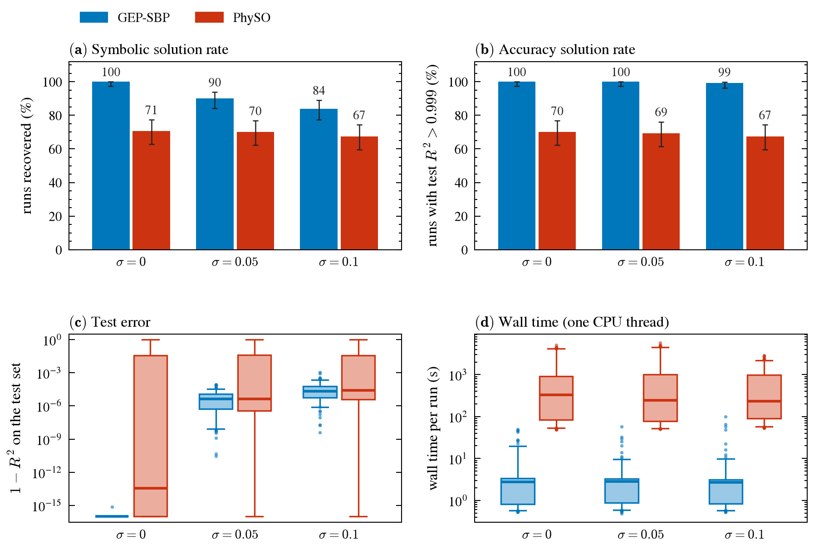
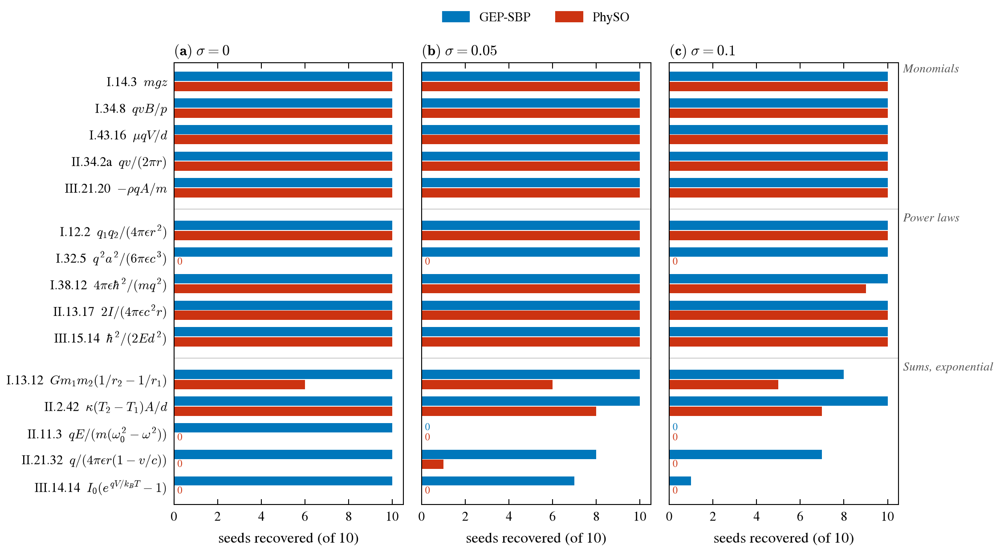
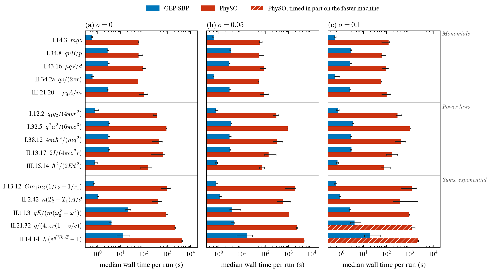
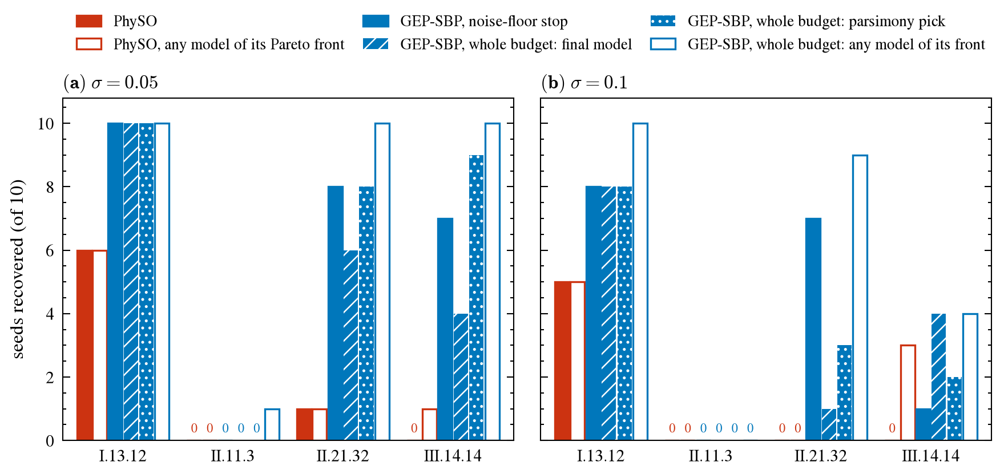

# GEP-SBP vs PhySO on 15 Feynman equations with units

GEP with semantic backpropagation (GEP-SBP, this package) against PhySO 1.1.11 (Tenachi
et al., ApJ 2023), which builds units into its sampling prior. Both get the units of the
inputs and the target, the same data and the same candidate budget.

## Setup

* **Equations.** 15 AI-Feynman equations whose inputs span at least three SI base
  dimensions, five each of three kinds: monomials, power laws, sums and exponentials.
* **Data.** 1 000 training points per seed (10 seeds), 10 000 noise-free test points per
  equation. With noise level σ, the training targets get σ · RMS(y) · N(0, 1); σ = 0, 0.05,
  0.1.
* **Budget and stop.** About 3 × 10⁵ candidates per run (PhySO: 30 epochs of 10 000;
  GEP-SBP: 1 700 + 430 × 700). A run stops when its training NRMSE reaches 10⁻⁵ without
  noise, or the noise floor (the true formula's NRMSE on the noisy data) with noise.
* **Methods.** PhySO with its Feynman-benchmark settings (`config1`, two free constants);
  GEP-SBP with three genes, linear scaling and the SBP library.
* **Recovery.** The SRBench criterion as PhySO implements it (constants rounded to two
  decimals, then the difference or ratio to the true formula must be constant), with
  the corrections under *Symbolic check*.
* **Timing.** One CPU thread per run.

## Results

| | σ = 0 | σ = 0.05 | σ = 0.1 |
|---|---:|---:|---:|
| symbolic solution rate, GEP-SBP | **150 / 150** | **135 / 150** | **126 / 150** |
| symbolic solution rate, PhySO | 106 / 150 | 105 / 150 | 101 / 150 |
| test R² > 0.999, GEP-SBP / PhySO | 150 / 105 | 150 / 104 | 149 / 101 |
| median wall time per run, GEP-SBP / PhySO | 2.7 s / 330 s | 2.8 s / 246 s | 2.7 s / 235 s\* |
| all 150 runs, GEP-SBP / PhySO | 701 s / 32.4 h | 543 s / 35.3 h | 663 s / 26.1 h\* |

\* 17 PhySO runs (II.21.32 seeds 4–10, all of III.14.14) ran on a 1.7–2.1× faster machine
after a container restart; see *Caveats*.



*Figure 1. (a) Symbolic and (b) accuracy solution rate with 95 % Wilson intervals;
(c) test error and (d) wall time per run (boxes: quartiles, whiskers: 5th–95th
percentile; 1 − R² below 10⁻¹⁶ drawn at 10⁻¹⁶, R² ≤ 0 or no model at 1).*



*Figure 2. Recovered seeds per equation.*



*Figure 3. Median wall time per equation, interquartile range as error bars; hatched:
PhySO timed in part on the faster machine.*

* **Recovery.** Both solve every monomial. GEP-SBP solves every power law at every noise
  level; PhySO never solves I.32.5 (no unit-consistent candidate in 8 of 10 runs). On the
  sums GEP-SBP goes from 100 % to 70 % and 52 % with noise, PhySO from 32 % to 30 % and
  24 %.
* **GEP-SBP's misses with noise still fit the test data** (299 of 300 noisy runs have
  R² > 0.999). They are either the true terms with separately fitted coefficients
  (−0.993 Gm₁m₂/r₁ + 0.989 Gm₁m₂/r₂ for I.13.12), which the 2-decimal rounding rejects,
  or other formulas the noisy data cannot tell from the true one (II.11.3). PhySO's
  misses are wrong forms after the whole budget (median R² 0.72–0.97).
* **Speed.** On the same data, the median ratio of PhySO's wall time to GEP-SBP's is
  107× without noise and 136× with it; over all runs PhySO takes 142–235× longer.

## Whole budget with an accuracy-complexity front

On the four equations where GEP-SBP's noise-floor stop misses seeds, GEP-SBP was rerun
for the whole budget (`gep_run.jl stop=none front=true`), keeping the best model of
every size. Recovered seeds out of 40 (four equations × 10), σ = 0.05 / 0.1:

| GEP-SBP, noise-floor stop | whole budget: final model | parsimony pick | any model on the front | PhySO | PhySO, any on its Pareto front |
|---:|---:|---:|---:|---:|---:|
| 25 / 16 | 20 / 13 | 27 / 13 | **31 / 23** | 7 / 5 | 8 / 8 |



*Figure 4. Per equation; the parsimony pick is the smallest front model within 1 % of the
noise floor's training error.*

The longer search finds the formula more often (front: 31 and 23), but the model a run
returns does not improve, as the extra epochs fit noise. Near the floor the fronts are
flat, so choosing the true model from them is the hard part. II.11.3 stays out of reach
(1 of 20). A whole-budget run takes a median 711 s on the first machine and 328 s on the
faster one, against 1 000–3 500 s for PhySO on these equations.

## Symbolic check

`judge.py` uses PhySO's `compare_expression`, with four corrections that apply to both
methods:

* **One coefficient per term.** The model's numbers are merged before rounding, so
  `0.368·exp(u + 1)` and `1.0007·exp(u)` get the same verdict.
* **PhySO's protected operators.** Its square roots and logarithms are read as it
  computes them, of |x|, and its constant subexpressions with its protected division.
* **Exact rounding.** PhySO's rule is applied with exact node replacement. Its own
  `subs`-based version can put a value on the wrong term.
* **No π fractions.** PhySO's π-fraction step, meant for trigonometric formulas, would
  zero any coefficient below 0.031. None of the 15 formulas has a trigonometric
  function, so it is left out.

`audit_symbolic.py` checks every final model against numbers:

* **Readings.** All 450 GEP-SBP models reproduce Julia's test R². 416 of 426 PhySO
  models reproduce PhySO's own; the rest differ through its protected division.
* **Canonical forms.** The rewritten form the check rounds matches the model on the test
  points.
* **Verdicts.** Recovered runs under three criteria, σ = 0 / 0.05 / 0.1:

| check | GEP-SBP | PhySO |
|---|---:|---:|
| **symbolic, as reported** | **150 / 135 / 126** | **106 / 105 / 101** |
| symbolic, with PhySO's π-fraction step | 150 / 137 / 127 | 106 / 105 / 101 |
| numeric: equal to the formula within 1 % on the test set | 150 / 123 / 99 | 106 / 105 / 96 |

Without noise all three agree on every model. With noise the 2-decimal rounding is
absolute: next to a small coefficient such as 1/(4π) ≈ 0.08 it tolerates extra terms of a
few percent, which GEP-SBP's three linearly scaled genes produce (I.12.2 at σ = 0.1). The
numeric test is in turn too strict on differences (I.13.12, II.2.42), so it serves as a
sensitivity check, not as the rate. `results/audit_symbolic<tag>.csv` has every verdict.

## Caveats

* **Budget.** 3 × 10⁵ candidates is 30 % of SRBench's 10⁶; PhySO's failed runs used all
  of it.
* **Settings.** PhySO runs with its published defaults. GEP-SBP's settings were fixed
  after one probe on two of the equations.
* **Equation set.** The set suits SBP: most targets are products of powers of the
  inputs, which the SBP library enumerates.
* **Noise-floor stop.** It uses the true formula's error, which a user would not know.
  The front experiment shows the alternative.
* **Machine change.** A container restart moved the last runs to a 1.5–2× faster host:
  17 PhySO runs at σ = 0.1 and 46 of the 80 whole-budget GEP-SBP runs
  (`results/faster_machine.csv`). Rerunning the same runs gives identical GEP-SBP
  models; only the times differ.
* **Units.** Both methods use PhySO's AI-Feynman unit table. `assets/case_dsc.json` had
  30 entries with wrong units and inconsistent formulas; it now follows the same table
  (`check_case_dsc.py` checks it, `--fix` rewrites it, and its docstring lists what was
  wrong).

## Reproduction

```
JULIA=julia PYTHON=python bash paper/comparisonPhySo/run_all.sh
```

This runs `export_data.py`, `gep_run.jl` (4 processes), `physo_batch.py` (3 processes),
`judge.py`, `audit_symbolic.py` and `make_figures.py` for σ = 0, 0.05 and 0.1.
`PYTHON` needs physo 1.1.11 (torch), sympy, numpy, pandas, matplotlib and SciencePlots;
Julia 1.12 needs the package's `Manifest.toml`.

The whole-budget runs, then their judging:

```
julia --project=. --threads=1 paper/comparisonPhySo/gep_run.jl stop=none front=true \
    noise=0.1 equations=I.13.12,II.11.3,II.21.32,III.14.14 \
    out=paper/comparisonPhySo/results/gep_front_noise0.1
python paper/comparisonPhySo/judge_front.py --noise 0.05 0.1
```

`results/` holds one JSON per run (`gep<tag>/`, `physo<tag>/`, `gep_front<tag>/`), the
judged tables (`summary<tag>.csv`, `summary_front<tag>.csv`), the audit tables and the
figures (PDF and PNG).
