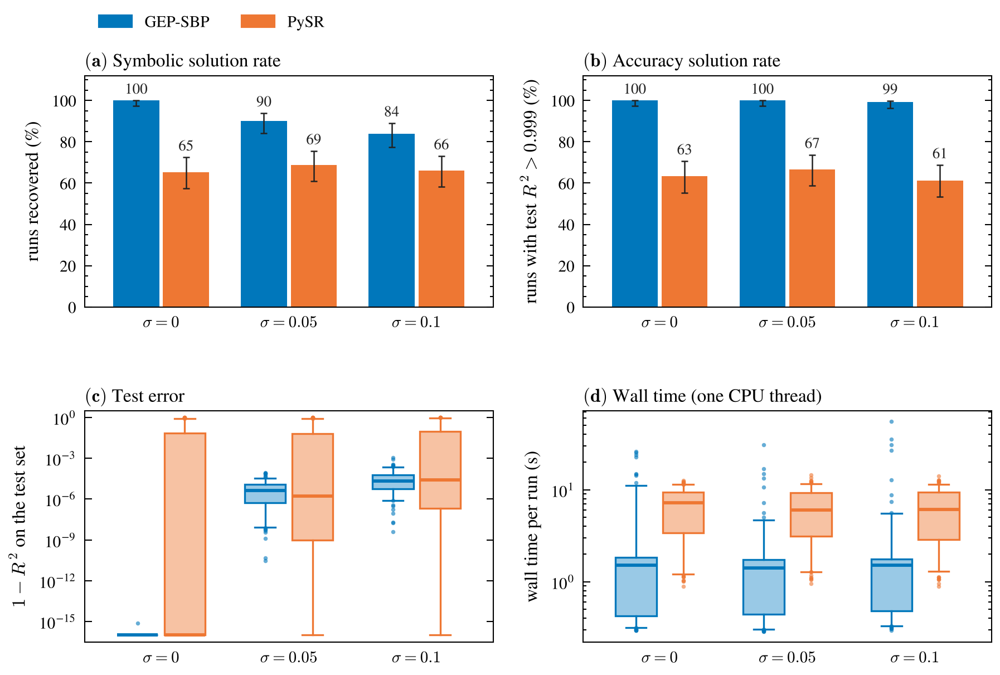
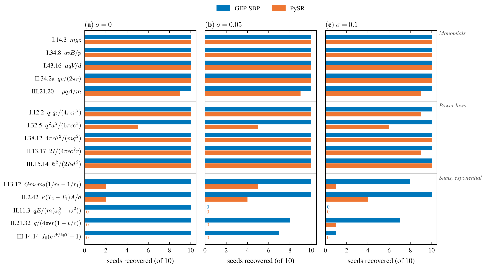
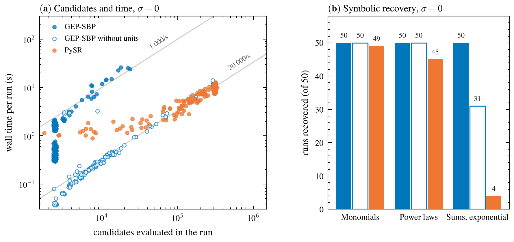
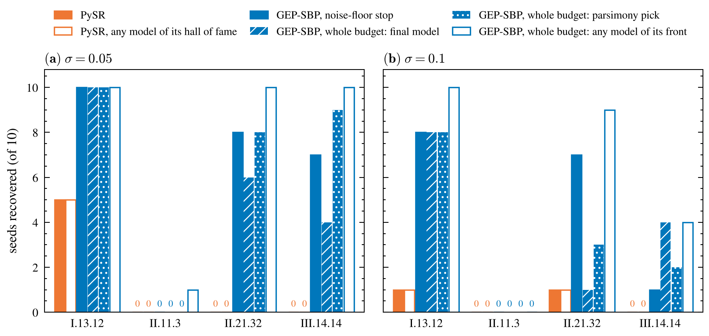
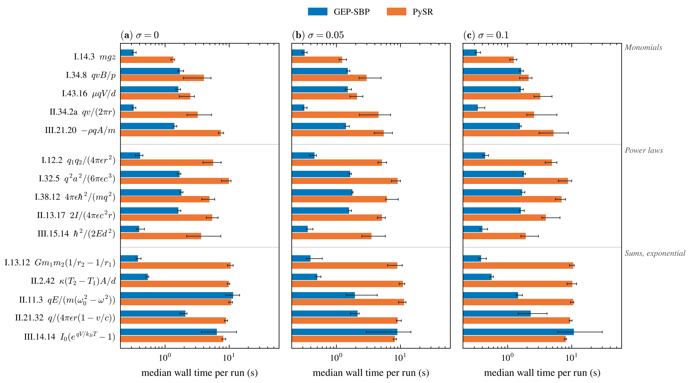

# GEP-SBP vs PySR on 15 Feynman equations with units

GEP with semantic backpropagation (GEP-SBP, this package) against PySR 2.7.0 (Cranmer,
arXiv:2305.01582; SymbolicRegression.jl 2.7), on 15 AI-Feynman equations whose inputs and
target carry units. Both methods get the same data, the same units, the same candidate
budget and the same stop, and one check judges both.

**In short.** At the same budget of about 3 × 10⁵ candidates, GEP-SBP recovers all 150
noise-free runs and PySR 98. With noise GEP-SBP recovers 135 and 126 of 150 by SRBench's
criterion, PySR 103 and 99; counting only models that are the formula with its own
constants, 122 and 96 against 98 and 87. GEP-SBP takes a median 1.5 s per run, PySR
6–7 s. PySR is the faster evaluator, about 29 000 candidates per second on one thread
against GEP-SBP's 700–900; GEP-SBP wins because it needs 37 to 62 times fewer candidates:

* **Linear scaling** over three genes fits every coefficient, so the search is for
  structure only. Without units GEP still recovers 131 of the 150 noise-free runs.
* **SBP** seeds the first generation with unit-consistent terms, which solves every
  monomial and power law there, and the units decide the three formulas that are not
  sums of products of powers (II.11.3, II.21.32, III.14.14).
* SBP is also what a GEP-SBP candidate costs: 97 % of its time.

With its own default budget, 9 times larger, PySR solves 53 of the 70 noise-free runs it
misses here, in a median 22 s per run.

## Setup

* **Equations.** 15 AI-Feynman equations whose inputs span at least three SI base
  dimensions, five each of three kinds: monomials, power laws, and sums and
  exponentials (`common.py`). Formulas, input ranges and units are the AI-Feynman
  benchmark's, as the `physo` package defines them.
* **Data.** 1 000 training points per seed (10 seeds) and 10 000 noise-free test points
  per equation, drawn uniformly from the AI-Feynman ranges; with noise level σ the
  training targets get σ · RMS(y) · N(0, 1), σ = 0, 0.05, 0.1.
* **Units.** Both methods get the SI units of the inputs and the target and use
  dimensionless constants. PySR takes them as `X_units` and `y_units` with
  `dimensionless_constants_only=True`; a candidate whose units do not check gets PySR's
  default penalty of 1000 on its loss. GEP-SBP repairs such candidates by SBP and scores
  only unit-consistent ones.
* **Budget and stop.** About 3 × 10⁵ candidates per run. PySR: 31 × 27 random
  candidates, then 11 iterations of 31 populations × 380 cycles × 2 tournament rounds,
  each round a mutation (one candidate) or, with probability 0.2, a crossover (two):
  837 + 11 × 23 560 × 1.2 ≈ 3.1 × 10⁵ (a few percent fewer, as some mutations are
  no-ops). GEP-SBP: 1 700 + 430 × 700. A run stops when its training NRMSE reaches 10⁻⁵
  without noise, or the noise floor (the true formula's NRMSE) with noise; for PySR
  through `early_stop_condition` on the mean squared error.
* **Methods.** PySR with its defaults (31 populations of 27, maxsize 30, BFGS for the
  constants, its default plugins, `model_selection="best"`), GEP-SBP's operators
  (+ − × ÷ square sqrt exp log sin cos), 64-bit floats as the data, serial and
  deterministic (`pysr_run.py`). GEP-SBP with three genes, linear scaling and the SBP
  library (`gep_run.jl`).
* **Timing.** One CPU thread per run, four runs at a time, both methods on one machine.
  PySR is timed over its `fit`, GEP-SBP over building its regressor (the SBP library) and
  fitting it, each after an untimed warm-up that compiles the Julia code. Both are
  deterministic: rerunning a run gives the same model; only the time differs.

## How recovery is assessed

A run counts as a **symbolic solution** by SRBench's criterion (La Cava et al., 2021): with
every float of the model and of the formula rounded to two decimals, the difference of
the two, or their ratio, simplifies to a constant. `judge.py` runs it through the
`compare_expression` of the `physo` package's AI-Feynman benchmark, with five
corrections:

* **One coefficient per term.** The model's numbers are merged before the rounding, so
  that `0.368·exp(u + 1)` and `1.0007·exp(u)` get the same verdict.
* **Exact rounding.** The library's rounding replaces floats one by one with sympy's
  `subs`, which can put a value on the wrong term; here all are replaced at once.
* **No π fractions.** The library also tries every float as a fraction of π, for
  constants in a sine, which turns any coefficient below 0.031 into 0. None of the 15
  formulas has a trigonometric function, so this is left out.
* **No zero models.** The library divides the formula by the model after rounding; for a
  model that becomes 0 the ratio is nan, which sympy calls constant, so it accepted
  such a model. Eight final PySR models are identically 0, such as
  `x5 * ((x1 * (x1 - x1)) / x4)` for I.13.12 (test R² ≈ 0); they now fail.
* **A timeout that holds.** A check that runs over 60 s counts as a failure. The alarm
  was an `Exception`, which the library catches around each of its steps, so a slow
  check ran on (one for over 30 minutes); it is now raised past those handlers.

What the criterion accepts, on models built from each of the 15 formulas f
(`check_criterion.py`; x is the first input and m the middle of its range):

| model | symbolic (SRBench) | numeric version of it | equal to f |
|---|---:|---:|---:|
| f | 15 | 15 | 15 |
| f with its constants 0.5 % off | 15 | 15 | 15 |
| 2 f | 15 | 15 | 0 |
| f + 1 | 15 | 15 | 0 |
| f (1 + 0.01 x/m): an extra term of about 1 % | 15 | 15 | 0 |
| f (1 + 0.05 x/m): an extra term of about 5 % | 7 | 0 | 0 |
| f with an input missing, with an exponent off, or 0 | 0 | 0 | 0 |

The criterion accepts the formula up to a constant factor or shift, by design, and its
rounding is absolute: an extra term survives only if its coefficient reaches 0.005, so
next to a small coefficient such as 1/(4π) ≈ 0.08 it lets through extra terms of 5 % (7
of the 15 formulas). Hence a second, strict criterion: **equal to the formula**, the
model's constants included, on the 10 000 noise-free test points, to 1 % (the 99th
percentile of |model / f − 1| at most 0.01, or of |model − f| at most 1 % of f's
standard deviation, for formulas that cross zero). `audit_symbolic.py` computes it and
the numeric version of the symbolic criterion (the ratio or the difference constant to
1 %) for every final model, and checks the readings: all 900 final models, read through
sympy and evaluated as printed, reproduce the test R² the methods report to 10⁻⁶, and the
forms the check rounds match the models to 10⁻¹⁴.

## Results

### Recovery and time

| | σ = 0 | σ = 0.05 | σ = 0.1 |
|---|---:|---:|---:|
| symbolic solution (SRBench), GEP-SBP | **150 / 150** | **135 / 150** | **126 / 150** |
| symbolic solution (SRBench), PySR | 98 / 150 | 103 / 150 | 99 / 150 |
| equal to the formula, GEP-SBP / PySR | **150** / 95 | **122** / 98 | **96** / 87 |
| test R² > 0.999, GEP-SBP / PySR | 150 / 95 | 150 / 100 | 149 / 92 |
| median wall time per run, GEP-SBP / PySR | 1.5 s / 7.2 s | 1.4 s / 6.0 s | 1.5 s / 6.1 s |
| all 150 runs, GEP-SBP / PySR | 374 s / 970 s | 275 s / 950 s | 366 s / 932 s |

Per run, PySR takes a median 4.3, 4.8 and 4.4 times as long as GEP-SBP.



*Figure 1. (a) Symbolic and (b) accuracy solution rate with 95 % Wilson intervals;
(c) test error and (d) wall time per run (boxes: quartiles, whiskers: 5th–95th
percentile; 1 − R² below 10⁻¹⁶ drawn at 10⁻¹⁶, R² ≤ 0 at 1).*



*Figure 2. Recovered seeds per equation (symbolic solution).*

* **Where PySR falls short.** It solves the monomials (49 of 50 at every noise level)
  and most power laws (45, 45, 44 of 50; I.32.5 in half the runs), but only 4, 9 and 6 of
  50 runs on the sums and the exponential, against GEP-SBP's 50, 35 and 26. It never
  finds II.11.3 or III.14.14 and finds II.21.32 once in 30 runs; it returns the leading
  factor, qE/(mω₀²) (test R² 0.96) and q/(εr) (0.93), and for III.14.14 rational stand-ins
  for the exponential (median R² 0.14). Its misses are wrong forms (median test R² 0.74,
  0.72, 0.69). GEP-SBP misses only with noise, and its misses still fit the test data
  (median R² 0.99996 and 0.99988): other combinations of unit-consistent terms the noisy
  data cannot tell from the formula, such as
  0.45 qE/(m(ω₀² − ωω₀)) + 0.40 qE/(mω₀²) + 0.016 qE/(mωω₀) for II.11.3.
* **What the two criteria separate.** PySR's symbolic solutions that are not the formula
  (3, 5 and 10 runs) have the right form with a constant factor PySR did not fit, such as
  −0.45 q²a²/(εc³) for I.32.5 (the factor is 1/(6π) ≈ 0.053; test R² −100) or −ρqA/m
  without its sign. GEP-SBP's (0, 17 and 32, on I.12.2, I.13.12, II.2.42 and II.21.32)
  are the formula plus terms whose coefficients the rounding sets to 0, such as
  −0.0019 q₂²/(εr²) next to 0.081 q₁q₂/(εr²) for I.12.2; they fit the noise, with a
  median test R² of 0.99999 and 0.99996. 4 and 2 GEP-SBP models (II.11.3, II.21.32, III.14.14) go the other way:
  equal to the formula to 1 %, but rejected by the rounding, such as
  0.998 I₀e^(qV/k_BT) − 0.99 I₀.

### Why: fewer candidates, not cheaper ones



*Figure 3. Without noise. (a) Every run's candidates and wall time (runs at the same
count spread by up to ±5 % to the side); grey lines: equal throughput, in candidates per
second. (b) Runs recovered per group. "Without units" is `gep_run.jl units=false`, which
drops the SBP library and the repair (`results/gep_nounits/`).*

| without noise, one thread | GEP-SBP | GEP-SBP without units | PySR |
|---|---:|---:|---:|
| candidates per second | 690–910 | 27 900 | 29 000 |
| candidates to a recovered model, median: monomials / power laws / sums | 2 400 / 2 400 / 3 100 | 3 800 / 8 000 / 16 400 | 89 000 / 139 000 / 191 000 |
| recovered, of 150 | 150 | 131 | 98 |
| test R² > 0.999, of 150 | 150 | 141 | 95 |
| median wall time per run | 1.5 s | 0.26 s | 7.2 s |

GEP-SBP's rate is from runs that use many epochs (7 runs over 20 000 candidates, and the
profile below). Each reason is measured:

* **SBP is what a GEP-SBP candidate costs.** In a profile of a 100-epoch run (II.11.3,
  σ = 0.1, seed 1, which never reaches the floor; `profile_gep.jl`) 97 % of the time is
  in `src/Sbp.jl`: the unit repair's requirement costs, reach searches and split
  proposals, and the propagation of units through the trees. Evaluating, scaling and
  selecting take about 2 %. Without units the same run evaluates 27 000–30 000
  candidates per second against 690 (two timings), so GEP's evaluator is as fast as
  SymbolicRegression.jl's and a repaired candidate costs 40–43 times one without. PySR
  only checks units, as a term of the loss, at about 15 % per candidate (33 600
  candidates per second without units, 28 800 with).
* **Linear scaling and SBP make the search short.** Each gene is a term and least
  squares fits one coefficient per gene, so a factor such as 1/(4π) needs no search, nor
  does the sum of two monomials in I.13.12 and II.2.42. PySR builds coefficients and terms
  by mutating one node at a time and tunes its constants by BFGS on 14 % of each
  population per iteration. Without units GEP recovers 131 of 150 from 12 to 23 times
  fewer candidates than PySR (PySR without units: 96). With units, half the starting
  population comes from the SBP library of unit-consistent terms (products of powers of
  the inputs with the target's units), and every gene is held to those units; with
  inputs spanning three or more base dimensions few such products exist, and all 100
  monomial and power-law runs stop at the first epoch, against a median of 3 and 9
  epochs without units.
* **The units decide the hard formulas.** The 19 recoveries SBP adds are on the three
  formulas that are not sums of products of powers: II.11.3 (1 of 10 without units, 10
  with), III.14.14 (2, 10) and II.21.32 (8, 10). SBP keeps the argument of exp
  dimensionless, which leaves qV/(k_BT), and it scores only candidates whose every gene
  has the target's units. PySR's penalty only ranks candidates and repairs none; it finds
  the exponential in none of its runs with units (at either budget) and in 1 of 10
  without. Without units GEP is also faster per run (0.26 s against 1.5 s): the units buy
  GEP-SBP these formulas, not speed.

### How much is the budget

On the seven equations PySR misses without noise, it was rerun with its default 100
iterations, about 2.8 × 10⁶ candidates or 9 times the shared budget
(`results/pysr_niter100/`). Recovered seeds of 10:

| | I.13.12 | I.32.5 | II.2.42 | III.21.20 | II.11.3 | II.21.32 | III.14.14 | all 70 |
|---|---:|---:|---:|---:|---:|---:|---:|---:|
| PySR, 11 iterations (shared budget) | 2 | 5 | 2 | 9 | 0 | 0 | 0 | 18 |
| PySR, 100 iterations (its default) | 10 | 10 | 10 | 10 | 7 | 6 | 0 | **53** |
| iterations PySR used, median | 20 | 17 | 21 | 8 | 92 | 67 | 100 | |
| median wall time, PySR at 100 iterations | 16 s | 15 s | 18 s | 8 s | 56 s | 38 s | 54 s | 22 s |
| GEP-SBP, shared budget | 10 | 10 | 10 | 10 | 10 | 10 | 10 | **70** |
| median wall time, GEP-SBP | 0.4 s | 1.7 s | 0.5 s | 1.4 s | 11.6 s | 2.1 s | 6.4 s | 1.6 s |

Most of PySR's misses are the budget's: it solves I.13.12, I.32.5 and II.2.42 in every
run, in a median 17–21 iterations (up to 80), and II.11.3 and II.21.32 in most, using
most of its default. III.14.14 stays out of reach: 5 runs reach test R² > 0.999 with
polynomials in the dimensionless group qV/(k_BT), none with the exponential. At its
default budget PySR would solve about 133 of 150 without noise (the other eight
equations stop within the shared budget in 78 of their 80 runs).

## Further checks

* **PySR without units** (`results/pysr_nounits/`, all 15 equations, no noise, shared
  budget): 96 of 150 recovered against 98 with units, test R² > 0.999 in 98 against 95, a
  median 6.2 s per run against 7.2 s. The units help PySR on the power laws (45 against
  36 of 50) and cost it on the sums (4 against 10; II.2.42: 2 against 7).
* **PySR's unit penalty** leaves some searches without a single unit-consistent model:
  10, 12 and 12 runs end with every model in the hall of fame over the penalty, 14 of
  the 34 on I.32.5.
* **Model selection.** PySR returns the model its `model_selection="best"` picks; the
  model with the lowest loss, which GEP-SBP returns, recovers 99, 103 and 101
  (`recovered_accuracy` in `results/summary<tag>.csv`).
* **Whole budget with an accuracy-complexity front.** On the four equations where
  GEP-SBP's noise-floor stop misses seeds, GEP-SBP was run for the whole budget, keeping
  the best model of every size (`gep_run.jl stop=none front=true`); PySR's hall of fame
  is such a front. Recovered seeds of 40, σ = 0.05 / 0.1 (Figure 4):

  | GEP-SBP, noise-floor stop | whole budget: final model | parsimony pick | any model on the front | PySR | PySR, any model of its hall of fame |
  |---:|---:|---:|---:|---:|---:|
  | 25 / 16 | 20 / 13 | 27 / 13 | **31 / 23** | 5 / 2 | 5 / 2 |

  The longer search puts the formula on GEP-SBP's front more often, but the model a run
  returns does not improve, as the extra epochs fit noise. PySR's hall of fame holds
  nothing its returned model misses, and 35 and 38 of its 40 runs already use the whole
  budget.
* **Time per equation** is in Figure 5.



*Figure 4. The front experiment per equation. The parsimony pick is the smallest front
model within 1 % of the noise floor's training error.*



*Figure 5. Median wall time per equation, interquartile range as error bars.*

## Caveats

* **Budget.** The comparison is one of equal candidate budgets, not of each method's
  best: 3 × 10⁵ candidates is a ninth of PySR's default, and the budget is most of its
  gap (*How much is the budget*).
* **Criterion.** SRBench's criterion accepts constant factors and, next to small
  coefficients, extra terms (*How recovery is assessed*); the strict row counts only the
  formula itself. With noise the two differ for both methods.
* **Settings.** PySR runs with its defaults but for the shared operators, units, budget
  and stop, 64-bit floats (its default is 32) and serial deterministic search.
  GEP-SBP's settings were fixed after one probe on two of the equations.
* **Equation set.** The set suits SBP: most targets are products of powers of the
  inputs, which the SBP library enumerates, and the units leave few of those.
* **Noise-floor stop.** It uses the true formula's error, which a user would not know.
  The front experiment shows the alternative.
* **Timeouts.** Which checks reach the 60 s limit depends on the machine's load; on
  these runs only wrong models (test R² below 0.99) are near it, so no verdict does.
* **Software.** Julia 1.12.7 from conda-forge, with the Julia packages fetched from
  GitHub, as the Julia package server was out of reach here; GEP-SBP's `Manifest.toml`
  was instantiated as is.

## Reproduction

```
JULIA=julia PYTHON=python bash paper/comparisonPySR/run_all.sh
```

This writes the data (`export_data.py`), runs `gep_run.jl` (also `units=false` without
noise) and `pysr_run.py` (4 processes each), then `judge.py`, `audit_symbolic.py` and
`make_figures.py` for σ = 0, 0.05 and 0.1. `PYTHON` needs pysr 2.7.0 (its Julia packages
install on first import), physo 1.1.11 (torch; for the AI-Feynman problems and the check),
sympy, numpy, pandas, matplotlib and SciencePlots. PySR runs on one thread with
`PYTHON_JULIACALL_THREADS=1`, which `run_all.sh` sets.

From `paper/comparisonPySR`: the whole-budget runs and their judging, PySR at its default
budget and without units, the criterion check and the profile:

```
for noise in 0.05 0.1; do
    julia --project=../.. --threads=1 gep_run.jl stop=none front=true noise=$noise \
        equations=I.13.12,II.11.3,II.21.32,III.14.14
done
python judge_front.py --noise 0.05 0.1
python pysr_run.py --niterations 100 --out results/pysr_niter100 \
    --equations I.13.12,I.32.5,II.11.3,II.2.42,II.21.32,III.14.14,III.21.20
python pysr_run.py --units none --out results/pysr_nounits
python judge.py --runs-dir results/pysr_niter100
python judge.py --runs-dir results/pysr_nounits
python check_criterion.py
julia --project=../.. --threads=1 profile_gep.jl II.11.3 100 0.1
```

`results/` holds one JSON per run (`gep<tag>/`, `pysr<tag>/`, `gep_front<tag>/`,
`gep_nounits/`, `pysr_niter100/`, `pysr_nounits/`), the judged tables (`summary<tag>.csv`,
`summary_front<tag>.csv`, `summary_gep_nounits.csv`, `summary_pysr_*.csv`), the audit
tables (`audit_symbolic<tag>.csv`, `criterion_check.csv`) and the figures (PDF and PNG).
