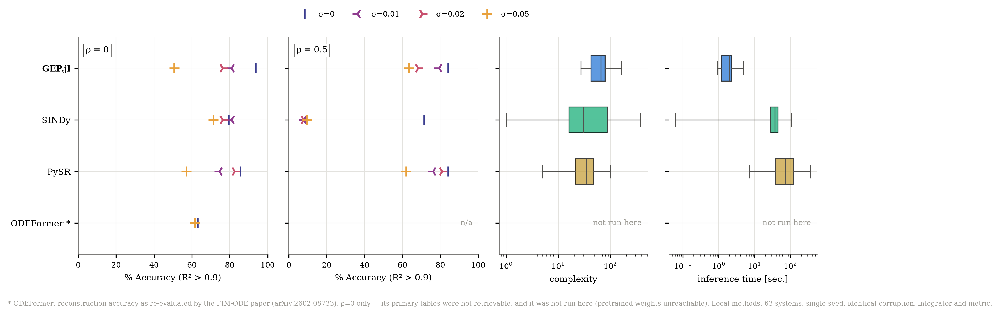

# Results: GeneExpressionProgramming.jl on ODEBench

The 63-system ODEBench benchmark (d'Ascoli et al., ODEFormer, ICLR 2024,
arXiv:2310.05573). GEP.jl, SINDy and PySR were run here under one protocol
(`odebench_gep.jl` for this package, `odebench_common.py` for the Python baselines; see
*Protocol* below for where they differ); the ODEFormer column is quoted, not run. The
figure is regenerated by `make_figure_rows.py`.



## Reconstruction accuracy — fraction of 63 systems with variance-weighted R² > 0.9

| σ    | ρ   | GEP.jl   | SINDy    | PySR     | ODEFormer\* |
|------|-----|---------:|---------:|---------:|------------:|
| 0    | 0   | **93.7** | 79.4     | 85.7     | 63.1        |
| 0.01 | 0   | **81.0** | **81.0** | 74.6     | —           |
| 0.02 | 0   | 76.2     | 76.2     | **82.5** | —           |
| 0.05 | 0   | 50.8     | **71.4** | 57.1     | 61.5        |
| 0    | 0.5 | **84.1** | 71.4     | **84.1** | —           |
| 0.01 | 0.5 | **79.4** |  7.9     | 76.2     | —           |
| 0.02 | 0.5 | 68.3     |  7.9     | **81.0** | —           |
| 0.05 | 0.5 | **63.5** |  9.5     | 61.9     | —           |

One seed per condition; bold marks the best local method in each row (one system is 1.6
points). Generalization accuracy (integrating from the second, unseen initial condition)
is in the same JSON files under `results/`; `make_figure.py` plots it for GEP.jl.

\* ODEFormer: its re-evaluation on ODEBench in the FIM-ODE paper (arXiv:2602.08733),
reconstruction, ρ = 0 only. ODEFormer's own tables were not retrieved, and it was not
re-run here (pretrained weights unreachable), so this column does not share the protocol
of the others. SITE has no row: it was not run on ODEBench. The PDE benchmark
(`../pdebench/`) runs its released code against GEP.jl and PDE-FIND.

**Provenance of the GEP.jl column.** `results/gep_sigma*_rho*_seed1.json`: population
600, 150 generations per component, from the current code, with gene averaging at its
defaults and the repaired transposition operators. Linear scaling is on throughout, so no
constant optimisation takes part. The previous run of this grid, from before gene
averaging existed and while the transposition slots still called
`reverse_insertion_tail!`, scored 93.7 / 69.8 / 68.3 / 54.0 % at ρ = 0 and
84.1 / 77.8 / 71.4 / 57.1 % at ρ = 0.5 (σ = 0 / 0.01 / 0.02 / 0.05), at a median of
3.1 s per system, timed in an earlier session; it and two intermediate reruns of the
clean condition are in the git history.

**Provenance of the baselines.** SINDy was rerun on all eight conditions (pysindy 2.1.0)
and reproduced every recorded R² and expression; only its times are new. PySR was rerun
on the clean condition (PySR 2.5.2 on SymbolicRegression.jl 2.4.2 and Julia 1.10.4) and
scores 85.7 % against the recorded 84.1 %: none of its 63 expressions matches the
recorded one, and 9 systems cross the 0.9 threshold (5 up, 4 down). Its search is
seeded, serial and deterministic and ends well inside its 20 s cap (about 3 s per
component here), so the difference lies in the software or the platform, not in the time
budget; the recorded runs do not state their PySR version. The table shows the rerun for
the clean condition; the other seven PySR cells are the runs recorded with the previous
grid, in an earlier session.

## What the comparison shows

* **Clean data (σ = 0, ρ = 0): GEP.jl leads** — 93.7 % against PySR 85.7, SINDy 79.4 and
  the quoted ODEFormer 63.1.
* **Noise on the full grid (ρ = 0): GEP.jl ties SINDy at low noise and trails at
  σ = 0.05** — 81.0 / 76.2 / 50.8 % at σ = 0.01 / 0.02 / 0.05, against SINDy's
  81.0 / 76.2 / 71.4 and PySR's 74.6 / 82.5 / 57.1.
* **Subsampling (ρ = 0.5) separates SINDy from the rest.** With noise it collapses to
  7.9–9.5 %. The likely cause: at σ > 0 its hyperparameter grid offers only
  Savitzky–Golay-smoothed differentiation, which assumes a uniform grid, and dropping
  half the samples breaks that; on clean subsampled data plain finite differences are in
  its grid and it keeps 71.4 %. GEP.jl and PySR fit local-polynomial derivative targets,
  which handle the irregular grid, and stay at 62–84 %; GEP.jl ties PySR clean (84.1),
  leads it at σ = 0.01 (79.4 against 76.2) and 0.05 (63.5 against 61.9), and trails it at
  0.02 (68.3 against 81.0).
* **Speed, and where it goes.** On this 4-core machine, each harness with its own
  parallelism, a condition of 63 systems took GEP.jl 2.7–2.9 min, SINDy 9.5–11.8 min
  and PySR 98 min (the clean condition), start-up included; per system the medians are
  **2.0 s**, 36.5 s and 71.3 s (2.1 s for GEP.jl on the clean condition). Most of the
  baselines' time is not their regression. The protocol selects candidates by
  integrating them, and the Python harnesses do that with a pure-Python RK4
  (`integrate_on_grid`), which took nearly all of SINDy's time and 85–95 % of PySR's in
  four systems timed separately; GEP.jl's harness does it in Julia (median 0.1 s). The
  regressions themselves take about 0.1 s per system for SINDy, about 3 s per component
  for PySR on one thread and a median 1.9 s per system for GEP.jl on 4 threads. So the
  medians compare pipelines, not regression methods: SINDy's regression alone is faster
  than GEP.jl's search. The harnesses also use the machine differently: GEP.jl runs one
  system at a time on 4 threads, SINDy four at once in separate processes (so a
  condition takes about a quarter of the per-system times' sum), PySR one at a time on
  one thread. The recorded baseline runs took 27.5 s (SINDy) and 71.8 s (PySR; 69.9 s
  on the clean condition) per system in the earlier session; SINDy's rerun, with
  identical results, took 1.3 times as long here, so times from the two sessions do not
  compare. The figure's time panel pools all eight conditions, so its PySR box is mostly
  the recorded runs.

## Protocol

All three local methods run on the same 63 systems with the same corruption procedure
(Julia's RNG for GEP.jl, numpy's for the baselines: a different draw, the same
distribution), RK4 integration along the 512-point reference grid, and variance-weighted
R². Differences and caveats:

* **Step cap.** GEP.jl integrates every candidate with h ≤ 10/2048 (five steps per
  reference interval); SINDy and PySR rank candidates with h ≤ 10/256 and score the winner
  with h ≤ 10/1024 (three steps).
* **Derivative targets.** GEP.jl and PySR use the same local cubic fit (7 samples, 15
  with noise); SINDy differentiates with its own finite differences.
* **Selection on clean data.** Every method ranks its candidates (at most d + 1 for
  GEP.jl and PySR, four for SINDy) by reconstruction R² against the *clean* training
  trajectory, integrated from its clean initial state — that is, by the reported metric
  itself. Under noise this is an optimistic, oracle-style choice; it applies to the three
  local methods alike, not to the quoted ODEFormer numbers.

## Reproducing

From `paper/odebench`:

```bash
# baselines (Python)
python odebench_sindy.py --sigma 0.05 --rho 0.5 --seed 1
python odebench_pysr.py  --sigma 0.05 --rho 0.5 --seed 1   # checkpoints per system
# this package (Julia); --out gives the file name the figure scripts look for
julia --project=../.. --threads=4 odebench_gep.jl --sigma 0.05 --rho 0.5 --seed 1 \
    --out results/gep_sigma0.05_rho0.5_seed1.json
# figure
python make_figure_rows.py
```

The PySR harness checkpoints every completed system to a `.partial` file and resumes on
restart, so an interrupted run loses at most the system in flight.

PDE discovery from field data is benchmarked separately, in `../pdebench/`.
